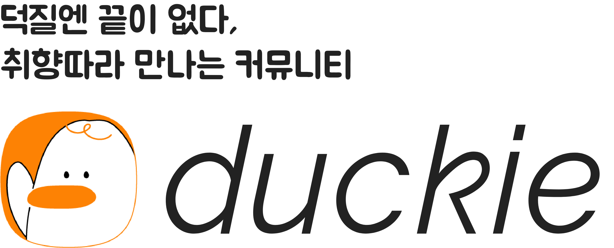

  

 

  
  
  
   
  
  
  

--- 

### TODO

1. 빌드 환경 기제
2. 배너? 폰트 변경
3. CI/CD 구축
4. 기술 블로그 개설
5. 브랜딩 페이지 개설
6. 기술 스택 기제
7. 레포 커버 디자인
8. 프로젝트 목표 기제
9. 팀원 소개
10. toml 마이그레이션

### 프로젝트 목표 메모

1. 커밋 1천번 이하
