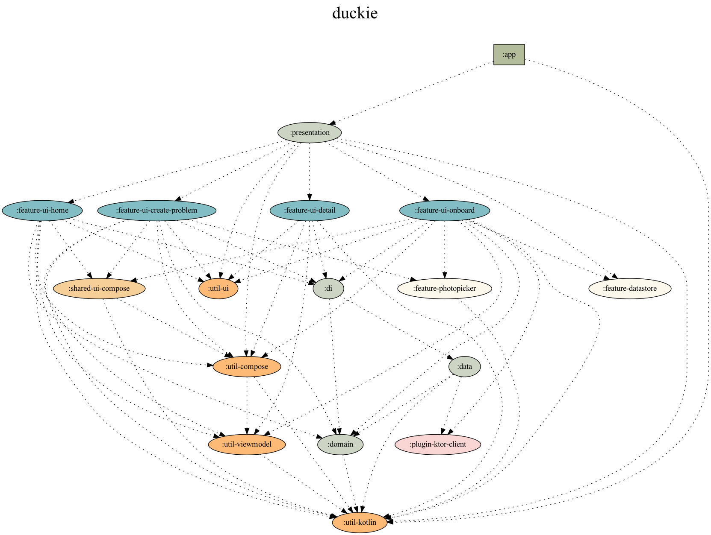

  

<h1 align="center">DUCKIE</h1>
<h5 align="center">덕질에 끝이 없다, 취향따라 만나는 커뮤니티!</h5>

  
  
  

---

# ‼️ WIP ‼️

## Introduction

We are creating a new fan community that didn't exist in the world to make the world a better place.

Our representative features include:

- Free and anonymous fan communication space (like Twitter)
- If you find fan goods you want, you can ask for a deal
- All transactions are commission-free!

> 덕키는 트위터처럼 자유로운 익명 공간에 당근마켓의 중고 거래 성격을 합친 서비스 입니다.  
> 보통 덕질은 트위터로 많이 하고, 트위터를 보다가 갖고 싶은 굿즈를 발견했지만 공식적으로 지원하는 거래 기능이 없어 불편한 점에서 시작됐습니다.  
> - [“Duckie” 를 소개합니다.](https://blog.duckie.team/duckie-%EB%A5%BC-%EC%86%8C%EA%B0%9C%ED%95%A9%EB%8B%88%EB%8B%A4-70b6a06ec806)

## Download

You can download it from the [Google PlayStore](https://play.google.com/store/apps/details?team.duckie.app.android).

## Contribute

> We love your contribution! 

Duckie's team is all Korean, so we're not good at English. So, most of the documentation was done in Korean. If you are familiar with Korean and English, perhaps the easiest and first contribution you can make is the English translation of documents. It will take some time, but it's a worthwhile incredible contribution for all of us, and we love English grammar improvements too, not just translations!

Anyway, *any* contribution is welcome, just make sure you follow the [contribution guide](.github/CONTRIBUTING.md).

### How to Launch Activity?

Edit Configurations -> Set `Launch Options` like this:

### Build prerequisites

1. This project is uses MavenLocal. Please run: `./gradlew :local-enums:publishToMavenLocal`.

## Project Dependencies Graph

  
   
  
  
  
  
  
  

## Tech Stacks (Korean)

TBD
